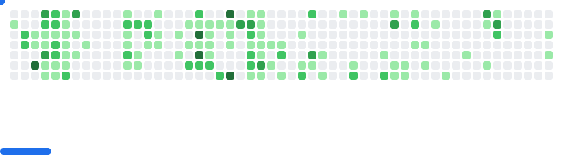

<h1 align="center">Jorge Sánchez</h1>

  
  
  
  
  
  
  
  

<h3 align="center">JavaScript Full Stack Developer | Engineering fanatic</h3>

  
  

 

    +9 years coding for the Web. Currently learning Machine Learning and Deep Learning with Python. Passionate about Rust ❤️‍🔥. Open to collaborating on open-source projects, especially Rust-based ones ☺️

---

  

    🧠 Artificial Intelligence integrations for webapps and desktop 🔧 Desktop super assistant powered by AI 💻 My very own, AI-powered, Operating System with Rust 🎮 Exploring Unreal Engine 5

## 📈 GitHub Stats

<picture>
  <source
    media="(prefers-color-scheme: dark)"
    srcset="images/breakout-dark.svg"
  />
  <source
    media="(prefers-color-scheme: light)"
    srcset="images/breakout-light.svg"
  />
  
</picture>

  

  

<!-- 

  
  

 -->
