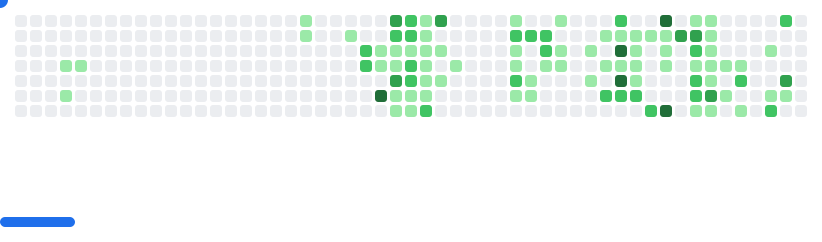

<h1 align="center">Jorge Sánchez</h1>

<h3 align="center">Software & Agent Developer</h3>

  
  

 

  Around 10 years of experience building software, especially full-stack websites and SPAs, including 3 years of professional remote work for clients and startups.

---

  

    🧠 Artificial Intelligence integrations for webapps and desktop 🔧 Desktop super assistant powered by AI 💻 Custom Rust kernel 🎮 Exploring Unreal Engine 5

## 📈 GitHub Stats

  <picture >
  <source
    media="(prefers-color-scheme: dark)"
    srcset="images/breakout-dark.svg"
  />
  <source
    media="(prefers-color-scheme: light)"
    srcset="images/breakout-light.svg"
  />
  
</picture>

  

  

<!-- 

  
  

 -->
